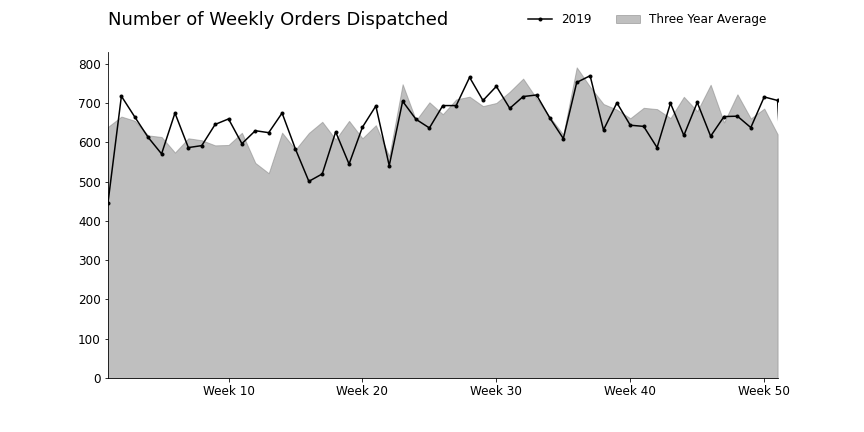

# Matplotlib-Line-Charts
Code from the article - [Line Chart Basics with Python’s Matplotlib](https://medium.com/python-in-plain-english/line-chart-basics-with-pythons-matplotlib-e52032981bd3)

Example:  

## Data source:
[UNAVAILABLE - Kaggle](https://www.kaggle.com/lewisgmorris/warehouse-picking-times)  
I still have a copy of the data at the `/data` directory, but the Kaggle page where it was originally hosted is unavailable. 